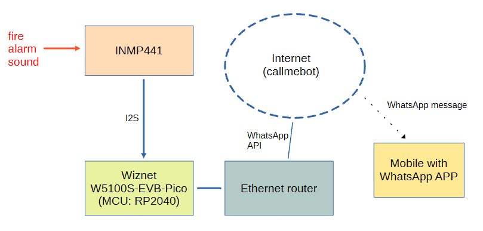
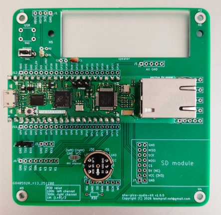
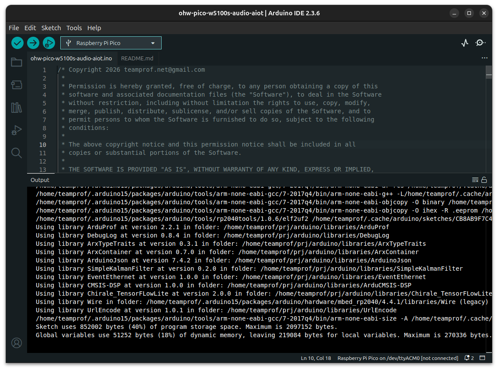
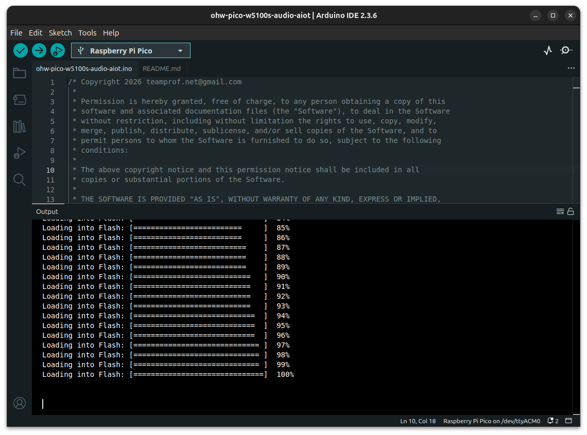
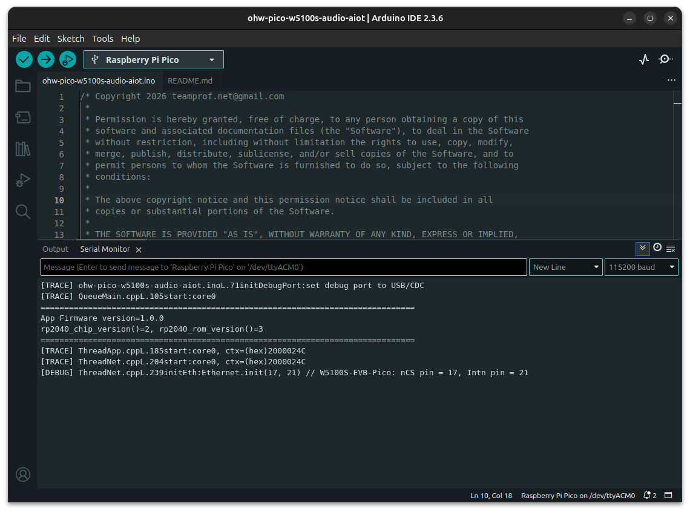
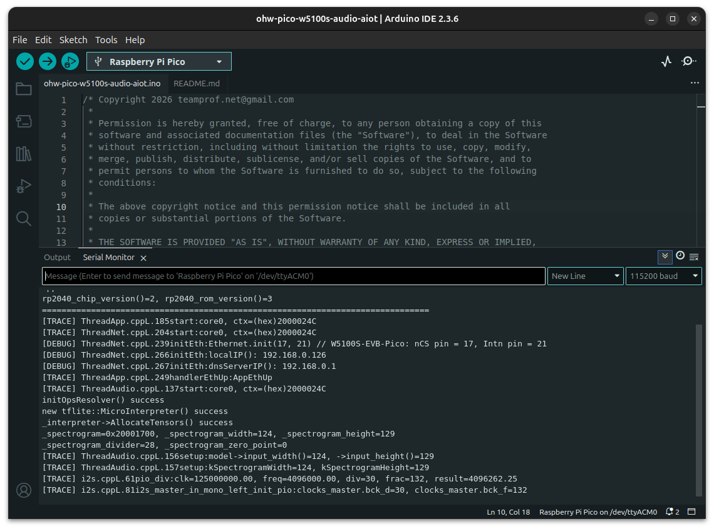
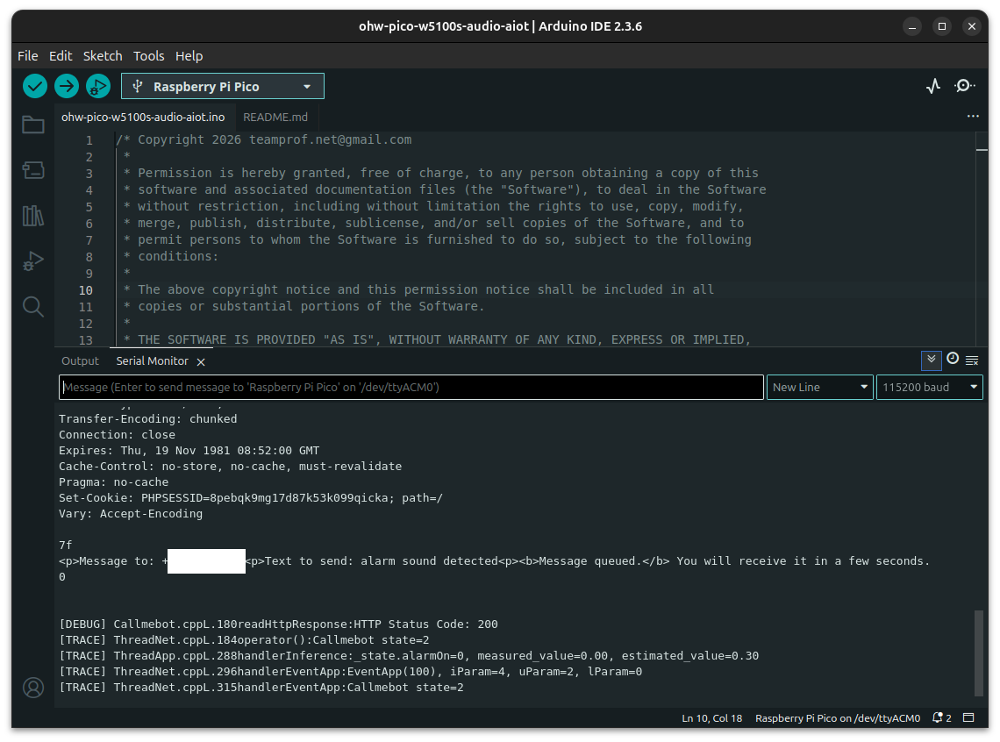
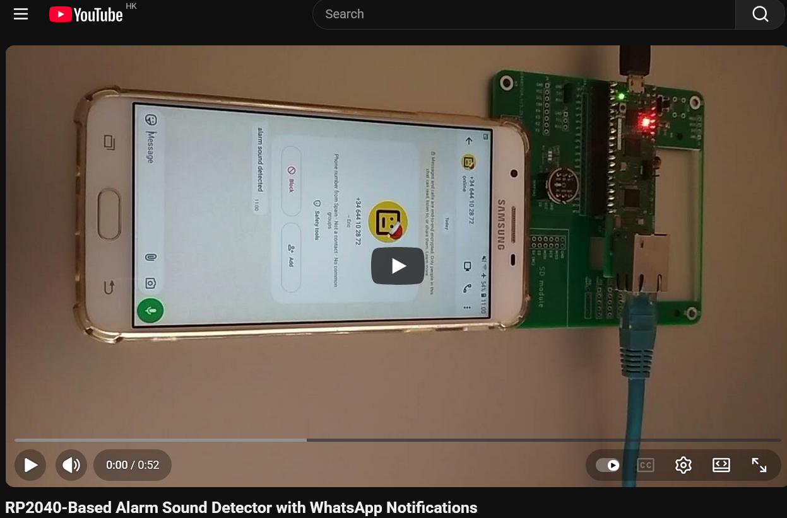
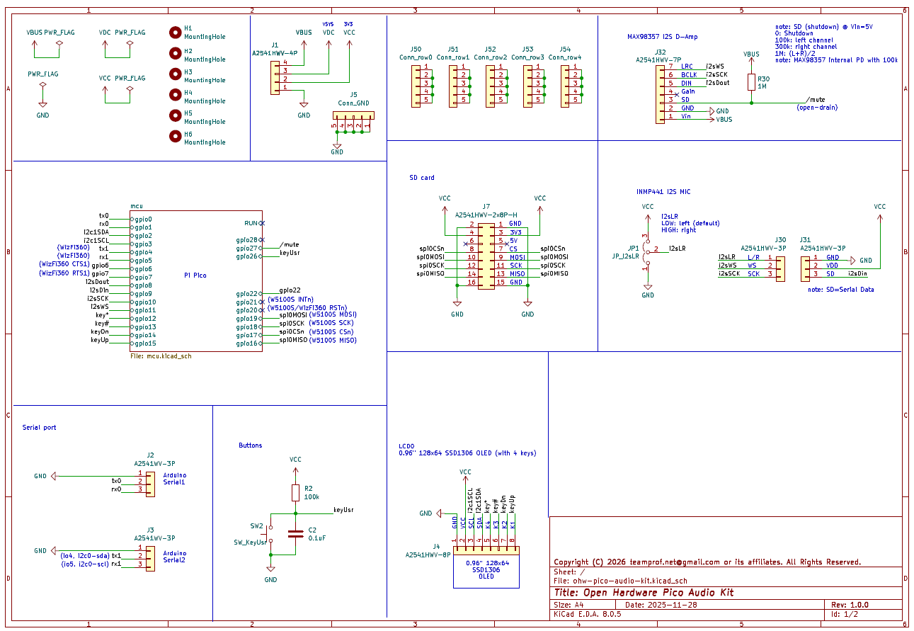
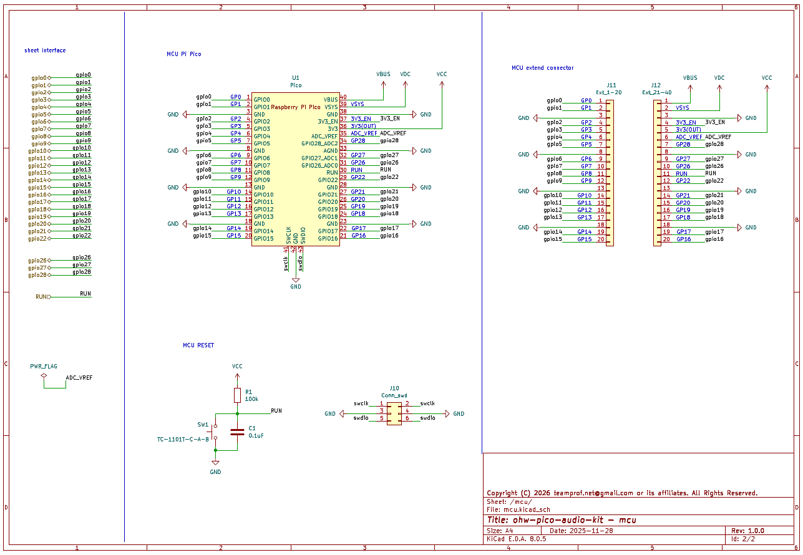

# Pi Pico Fire alarm sound detector running on W5100S Pico EVB
Integrating audio machine learning on Arduino platforms running Pico Mbed OS presents significant challenges, primarily due to the reliance on external audio libraries such as CMSIS-DSP, and TensorFlow Lite for Microcontrollers (TFLM). These libraries, while powerful, introduce complexities in compatibility and resource management, as they are not natively aligned with Arduino’s lightweight abstraction layers or the constrained runtime environment of Mbed OS.
The integrated platform offers a powerful advantage by seamlessly connecting advanced audio and IoT capabilities with the vast ecosystem of the Arduino community, enabling developers to extend thousands of features with minimal effort.  

Main features:
- W5100S Pico EVB (RP2040) running with Arduino Pico Mbed OS
- Integrate TensorFlow Lite micro
- Integrate CMSIS-DSP + CMSIS_6 Core (note: existing Arduino_CMSIS-DSP does NOT support RP2040 CM0+ MCU)
- Integrate Kalman filter into ML post-processing
- Support I2S 24-bit microphone
- Support WIZnet W5100S Ethernet connectivity
- Detect Fire Alarm Sounds and Notify Users via WhatsApp

This project demonstrates how a WIZnet W5100S Pico EVB, paired with an INMP441 microphone, can detect fire alarm sounds and send alert messages to the user via WhatsApp using an Ethernet connection.

[](https://github.com/teamprof/arduino-pico-w5100s-alarm-sound-detector/blob/main/LICENSE)

<a href="https://www.buymeacoffee.com/teamprof" target="_blank"></a>


### System diagram
[](https://github.com/teamprof/ohw-pico-w5100s-audio-aiot/blob/main/doc/image/system-diagram.png)


---
## Hardware
The following components are required for this project:
- ohw-pico-audio-kit PCB (available on [PCBway](https://www.pcbway.com/project/shareproject/Pi_Pico_Fire_alarm_sound_detector_95ef4add.html))
- W5100S Pico EVB
- TDK InvenSense INMP441
- PC with Arduino v2.3.6+ IDE and Arduino libraries installed (see Software setup section)
- a mobile device to receive WhatsApp message
- an audio device to generate fire alarm sound

---
## Device Block Diagram
```
    ┌───────────────────┐
    │  W5100S Pico EVB  │
    ├──────────┬────────┤     
    │  RP2040  │ W5100S │────► Ethernet 
    └─────▲────┴────────┘     
          |(I2S)         
    ┌─────┴─────┐  
    │  INMP441  │   
    └───────────┘  
```

## PCB Assembly
- Solder a pair of 20‑pin sockets to the PCB at the U1 - position
- Solder a pair of 3‑pin sockets to the PCB at the J30 - and J31 position
- Solder a 100kΩ resistor to the PCB at the R1 position
- Solder a 0.1uF capacitor to the PCB at the C1 position
- Solder a tactile switch  to the PCB at the SW1 position
- Solder a pair of 20‑pin header on the W5100S-EVB-Pico
- Solder a pair of 3‑pin header on the INMP441 module
- Mount the soldered W5100S-EVB-Pico on the PCB at the - designated U1 location
- Mount the soldered INMP441 module on the PCB at the - designated J30 and J30 locations
- Ensure the final PCBA is assembled as depicted in the figure below  
[](https://github.com/teamprof/ohw-pico-w5100s-audio-aiot/blob/main/doc/image/pcba-small.png)


---
## Software setup
- Install [Arduino IDE v2.3.6+ for Arduino](https://www.arduino.cc/en/Main/Software)
- Install [ArduTFLite, by Spazio Chirale](https://github.com/spaziochirale/ArduTFLite)
- Install [UrlEncode, by Masayuki Sugahara](https://github.com/plageoj/urlencode)
- Install [SimpleKalmanFilter, by Denys Sene](https://github.com/denyssene/SimpleKalmanFilter)
- Install [ArduProf v2.2.2+, by teamprof](https://github.com/teamprof/arduprof)
- Install [arduino-eventethernet, by teamprof](https://github.com/teamprof/arduino-eventethernet)
- Install [ArduCMSIS_DSP, by teamprof](https://github.com/teamprof/arducmsis_dsp)
- Clone this github code by
```
git clone https://github.com/teamprof/ohw-pico-w5100s-audio-aiot
```

---
### Build firmware
- Follow the instruction on https://www.callmebot.com/blog/free-api-whatsapp-messages/ to get the APIKey
- Install Arduino IDE and libraries according to section "Software setup"
- Clone this github code by "git clone ohw-pico-w5100s-audio-aiot"
- Open the ohw-pico-w5100s-audio-aiot.ino in Arduino IDE
- Open the secret.h file and replace the placeholder values with your mobile number and the API key provided by CallMeBot
```
#define MOBILE_NUMBER "<MobileNumber>"
#define APIKEY "<ApiKey>"
```
- On Arduino IDE, click menu "Tools" -> "Board: Rasberry Pi Pico" -> "Arduino Mbed OS RP2040 boards" -> "Rasberry Pi Pico "
- On Arduino IDE, click menu "Sketch" -> "Verify/Compile"  
If everything goes smoothly, you should see the following screen.
[](https://github.com/teamprof/ohw-pico-w5100s-audio-aiot/blob/main/doc/image/screen-build.png)

- Connect WIZnet W5100S Pico EVB to PC, upload firmware by clicking menu "Sketch" -> "Upload"  
If everything goes smoothly, you should see the following screen.
[](https://github.com/teamprof/ohw-pico-w5100s-audio-aiot/blob/main/doc/image/screen-upload.png)

- Launch "Serial Monitor" on Arduino IDE, press "RESET" button on the board, you should see the following screen.
[](https://github.com/teamprof/ohw-pico-w5100s-audio-aiot/blob/main/doc/image/screen-boot.png)

- Connect an Ethernet cable between the board and router, you should see the following screen.
[](https://github.com/teamprof/ohw-pico-w5100s-audio-aiot/blob/main/doc/image/screen-eth-up.png)

- Generate an alarm sound with an audio output device, the on-board green LED should be turned on and you should see the following screen.
[](https://github.com/teamprof/ohw-pico-w5100s-audio-aiot/blob/main/doc/image/screen-send-ok.png)

- You should receive a WhatsApp message on your mobile phone a few seconds later. See video demo for reference.

```
  +------------------------------------------------+
  |  source code will be available by End of Jan   |
  +------------------------------------------------+
```

---
### Software flow
When the device boots, it launches ThreadNet to initialize the WIZnet W5100S Ethernet controller. Once the Ethernet network is established, ThreadNet signals ThreadApp with an EthUp event. Upon receiving this event, ThreadApp blinks the on-board LED five times and then launches ThreadAudio.  
ThreadAudio initializes the INMP441 I²S microphone and starts the audio inference engine. The inference results are continuously sent from ThreadAudio to ThreadApp.  
ThreadApp evaluates these results, and if an alarm condition is detected, it instructs ThreadNet to send an alert message via WhatsApp.


## Activity diagram: 
```
                     ThreadAudio               ThreadApp                 ThreadNet  
                          |                        |                         |  
                          |                        |    launch ThreadNet     |  
                          |                        | ----------------------> |  
                          |                        |                         |  
                          |                        |    Ethernet ready       |  
                          |   launch ThreadAudio   | <---------------------- |  
                    +---- | <--------------------- |                         |  
    sound inference |     |                        |                         |  
                    +---> |                        |                         |  
                          |                        |                         |  
                          |                        |                         |  
   fire alarm sound       |                        |                         |  
------------------------> |  alarm sound detected  |                         |  
                          |----------------------> |        alarm on         |  callmebot to WhatsApp  
                          |                        | ----------------------> |  "alarm sound detected"
                          |                        |                         | ------------------------>
                          |                        |                         |  
                          |                        |                         |  
                          |                        |                         |  
    no alarm sound        |                        |                         |  
------------------------> |    alarm sound off     |                         |  
                          |----------------------> |        alarm off        |  callmebot to WhatsApp
                          |                        | ----------------------> |  "no alarm"
                          |                        |                         | ------------------------>
                          |                        |                         |  
```
---


## Video demo
[](https://youtu.be/vGwigJaA-SI)  

- 00:01 power up device => red LED turns on
- 00:03 Ethernet network is up => green LED blinks 5 times
- 00:08 generate fire alarm sound 
- 00:09 device detects fire alarm sound => green LED turns on, send WhatsApp message "alarm sound detected"
- 00:17 mobile received WhatsApp message "alarm sound detected"
- 00:19 stop alarm sound 
- 00:22 device detects no alarm sound => green LED turns off, send WhatsApp message "no alarm"
- 00:25 mobile received WhatsApp message "no alarm"
- 
- 00:27 generate fire alarm sound 
- 00:29 device detects fire alarm sound => green LED turns on, send WhatsApp message "alarm sound detected"
- 00:40 stop alarm sound 
- 00:42 mobile received WhatsApp message "alarm sound detected"
- 00:42 device detects no alarm sound => green LED turns off, send WhatsApp message "no alarm"
- 00:51 mobile received WhatsApp message "no alarm"


---
### Debug message
At boot, the system checks for USB CDC availability within "INIT_DEBUG_PORT_TIMEOUT" milliseconds; if detected, all debug messages are routed through USB CDC. If USB CDC is not available within that period, the system automatically falls back to UART0 to ensure debug output remains accessible. Debug port initialization code is available in "initDebugPort()".

Developers can enable or disable logging by modifying the code in "initDebugPort()"  
Debug is disabled by calling "LOG_SET_LEVEL(DebugLogLevel::LVL_NONE)" in "initDebugPort()"  
Enable trace debug by calling "LOG_SET_LEVEL(DebugLogLevel::LVL_TRACE)" in "initDebugPort()" 

Example of ohw-pico-w5100s-audio-aiot.ino
```
static void initDebugPort(void)
{
  ...

  LOG_SET_LEVEL(DebugLogLevel::LVL_TRACE);    // enable debug log
  // LOG_SET_LEVEL(DebugLogLevel::LVL_NONE);  // disable debug log

  ...
}
```

### Schematic
[](https://github.com/teamprof/ohw-pico-w5100s-audio-aiot/blob/main/doc/image/ohw-pico-audio-kit-v1.0.0.sch.pdf)
[](https://github.com/teamprof/ohw-pico-w5100s-audio-aiot/blob/main/doc/image/ohw-pico-audio-kit-v1.0.0.sch.pdf)

### License
- The project is licensed under GNU GENERAL PUBLIC LICENSE Version 3
---

### Copyright
- Copyright 2025 teamprof.net@gmail.com. All rights reserved.


<a href="https://www.pcbway.com/project/shareproject/Pi_Pico_Fire_alarm_sound_detector_95ef4add.html"></a>


